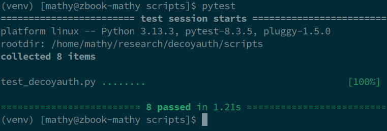
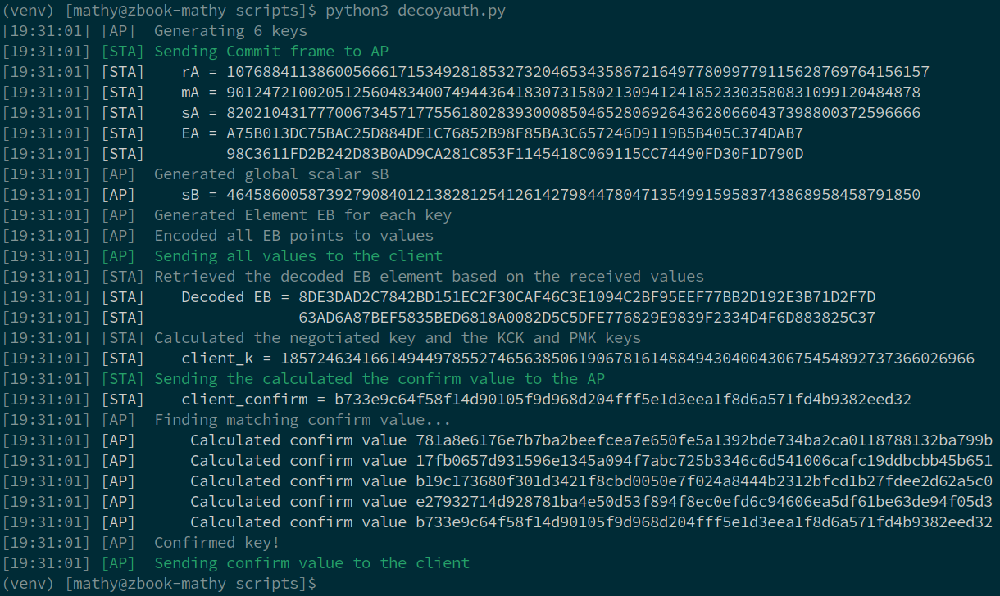

# DecoyAuth: Unit Tests & Test Vectors

This document explians how to run unit tests that verify the correctness of the Python proof-of-concept implementation of DecoyAuth. Additionally, we provide test vectors that specify the expected outputs for given inputs, allowing independent implementations of DecoyAuth to be tested for correctness. This is done for three main components of DecoyAuth: (1) secure element encoding; (2) message encoding; and (3) full message requests and responses.

<a id="id-toc"></a>
## 1. Table of Contents

- [1. Table of Contents](#id-toc)
- [2. Unit tests](#id-unit-tests)
- [3. Secure Element Encoding and Decoding](#id-element-encoding)
- [4. Message Encoding and Decoding](#id-message-encoding)
- [5. Message Requests and Responses](#id-message-requests-and-responses)


<a id="id-unit-tests"></a>
## 2. Unit tests

To execute the unit tests, first create a Python3 virtual environment. This only needs to be done once:

```
python3 -m venv venv
source venv/bin/activate
pip install -r requirements.txt
```

You can now run all unit tests using:

```
source venv/bin/activate
pytest
```

The output should be the following:



Note that all test vectors in this document use the secp256r1 curve parameters. For easy reference, the curve is defined over the following parameters:

| Parameter | Value | Description |
|:----------|:------|:------------|
| a | 0xFFFFFFFF00000001000000000000000000000000FFFFFFFFFFFFFFFFFFFFFFFC | Equals -3 mod p |
| b | 0x5AC635D8AA3A93E7B3EBBD55769886BC651D06B0CC53B0F63BCE3C3E27D2604B | |
| p | 0xffffffff00000001000000000000000000000000ffffffffffffffffffffffff | prime of the field |
| r | 0xffffffff00000000ffffffffffffffffbce6faada7179e84f3b9cac2fc632551 | #points on the curve |


<a id="id-element-encoding"></a>
# 3. Secure Element Encoding and Decoding

## Background

Points (e.g., elliptic curve points or field elements) must be securely serialized into byte strings for transmission, and later deserialized. To ensure the protocol is secure, this must be done in such a way so that every byte string encodes a valid point. We use Tibouchi’s encoding for this purpose.

## Functions

- `u, v = point_to_values(point, a, b, prime)`: converts an elliptic curve point P into two integers u and v. The other three argument define the elliptic curve being used, i.e., the two parameters a and b and the prime of the finite field being used. The function returns the two values u and v as the tuple (u, v). Note that this function is _not deterministic_: every call to this function returns a random valid encoding.

- `point = values_to_point(u, v, a, b, prime)`: converts two integers u and v into the corresponding elliptic curve point. The other three argument define the elliptic curve being used, i.e., the two parameters a and b and the prime of the finite field being used. The function returns the x and y values of the point as the tuple (x, y).

## Test Vectors

The function `point_to_values` generates a random internal value for the two parameters u and j, and then sees whether this results in a valid encoding using the internal function `point_to_values_for_u_j`. The overview below gives examples for the point to be encoded and values for u and j, and the resulting output v that is given by `point_to_values_for_u_j`:

```
--- Test vector 1 ---
Point x      0x12D4D7A6C9F0AB5AEFA23333BC1CDF1C74BAF471A609BE195FF1DCDF159F25EA
Point y	     0x1FC1DE07FD09F9C252522FD3C3FEF274B6063EA46D6BD4123870B052692C43BD
Internal u   0x1eec2cac75144e8ee1ea7e265cc2037d05fba6d8dcd0eae2282f9cfe7f4ff34e
Internal j   3
Output v     0x6d0b798762d5d606fb4605a3dc298b58034bdb171fc9a4b221bcabcdf4431c3d

--- Test vector 2 ---
Point x      0x82A689728B6991B3DE5EB4363D8DA7D95D14691B4D220E9FD2375FE239B17AB0
Point y	     0x7C4B4A95926581BD9328B0AFC2AF217214FD6FA59F55BB06091EDEA866175173
Internal u   0x2794a1cb1c776c726fd8fde0da43d008bc57aac937168c9554343586a1051a72
Internal j   3
Output v     0x26735102b201ecbb88da7657444819d07b164b9a22f8aeefe334329250578167

--- Test vector 3 ---
Point x      0x888837674F7254D03F64401EB23431DDC554BAB34B7A87A2606C332CA2E6CDC2
Point y	     0x195AC98C52F5FED05C7008D35277AB68396CCCABA37EE530DB0735621A864FA7
Internal u   0xf93c890af49b337e28e5d12daaf54f9a27392eaeca5bfd57d4350360137317b7
Internal j   0
Output v     0xf04d4b87921f04c93f6b31bdccf7c9cec08df9747fbafca22b142be85da5a99b
```

The test vectors below are to test the conversion from two values u and v the the x and y coordinates of the elliptic curve point:

```
--- Test vector 1 ---
Value u      0x1eec2cac75144e8ee1ea7e265cc2037d05fba6d8dcd0eae2282f9cfe7f4ff34e
Value v      0x6d0b798762d5d606fb4605a3dc298b58034bdb171fc9a4b221bcabcdf4431c3d
Output x     0x12D4D7A6C9F0AB5AEFA23333BC1CDF1C74BAF471A609BE195FF1DCDF159F25EA
Output y     0x1FC1DE07FD09F9C252522FD3C3FEF274B6063EA46D6BD4123870B052692C43BD

--- Test vector 2 ---
Value u      0x2794a1cb1c776c726fd8fde0da43d008bc57aac937168c9554343586a1051a72
Value v      0x26735102b201ecbb88da7657444819d07b164b9a22f8aeefe334329250578167
Output x     0x82A689728B6991B3DE5EB4363D8DA7D95D14691B4D220E9FD2375FE239B17AB0
Output y     0x7C4B4A95926581BD9328B0AFC2AF217214FD6FA59F55BB06091EDEA866175173

--- Test vector 3 ---
Value u      0xf93c890af49b337e28e5d12daaf54f9a27392eaeca5bfd57d4350360137317b7
Value v      0xf04d4b87921f04c93f6b31bdccf7c9cec08df9747fbafca22b142be85da5a99b
Output x     0x888837674F7254D03F64401EB23431DDC554BAB34B7A87A2606C332CA2E6CDC2
Output y     0x195AC98C52F5FED05C7008D35277AB68396CCCABA37EE530DB0735621A864FA7
```


<a id="id-message-encoding"></a>
# 4. Message Encoding and Decoding

## Background

Our protocol relies on password hiding encoding. This encoding takes a list of inputs (xs) and outputs (ys), and return a list of values (vals). The resulting values are sent to the reciever. The reciever can then combine these values with one of the inputs to get the corresponding output. When the receives uses an input that was not part of the input list, this will result in a random output. In the DecoyAuth protocol, the inputs are password hashes, and the outputs are point encodings. See the whitepaper for details.

## Functions

This functionality is implemented using the following 'weaving' functions:

- `matrix = precompute(xs, prime)`: precomputes a matrix from the given list of inputs. All calculations are done modulo the given prime. The resulting matrix can then be reused in the `weaver` function for different output (ys) lists.

- `vals = weaver(ys, matrix, prime)`: given a list of ouputs (ys) and the precomputed matrix, returns a list of values (vals). All calculations are done modulo the given prime.

- `y = eval_weave(vals, x)`: The receiver can use the list of values (vals) toghether with a given input x to calculate the corresponding output y. In case the input x was not part of the list xs given to precompute, then this function will return a random output.

## Test Vectors

Test vectors for the `precompute` function:

```
--- Test vector 1 ---
Input xs        [0, 1]
Modulus p       13
Output matrix   [[1, 0], [12, 1]]

--- Test vector 2 ---
Input xs        [0, 1, 7, 12]
Modulus p       13
Output matrix   [[1, 0, 0, 0], [11, 6, 7, 2], [12, 7, 0, 7], [2, 1, 6, 4]]

--- Test vector 3 ---
Input xs       [0xb978ded97cd42d43de79f385bbb5a30f6fde475bef67f42f2545adc1b8de48ae,
                0xb38725b87bb746384b1b1fb7999c5a4527cb34655b5fc7064ce2e48ba4c580d5,
                0xac475b1db500eb3d257ddb79b749294b4748f80a718059630ebca92974fe20dc]
Modulus p      secp256r1_p
Output matrix  [ [ 0x36af9b2504a2cef45b428a73450417dd5ba4e3b0b58d8c780179cdfc47ba9a5f,
                   0xfdeabbfcfcf4790c5a8760d1d9bcbbf1953d91d11361f1cc0d3911146492e838,
                   0xcb65a8dbfe68b8014a3614bae13f2c310f1d8a80371081bbf14d20ef53b27d68  ],
                 [ 0xce28e0b1b7e0fb871a1718f1b2470620378a71c3866e1cb05f1101019646d50f,
                   0x58e141785963f7e44bc6aaa1aed02f108260d6a8729a97987c2f6e60badc8f8d,
                   0xd8f5ddd3eebb0c969a223c6c9ee8cacf4614b79606f74bb724bf909daedc9b62  ],
                 [ 0x9cac2bc76af618be4b50c55411974c2026b85331ced8ef82cd4f8e5d341f5407,
                   0x7f1b9d6ef0861e6d222281e3b1a6d164f782a03bdba2987567964cf553c1be33,
                   0xe43836c7a483c8d6928cb8c83cc1e27ae1c50c9455847807cb1a24ad781eedc4  ] ]
```

Test vectors for the `weaver` function:

```
--- Test vector 1 ---
Input ys       [4, 8]
Input matrix   [[1, 0], [12, 1]]
Modulus p      13
Output vals    [4, 4]

--- Test vector 2 ---
Input ys       [0, 4, 9, 11]
Input matrix   [[1, 0, 0, 0], [11, 6, 7, 2], [12, 7, 0, 7], [2, 1, 6, 4]]
Modulus p      13
Output vals    [0, 5, 1, 11]

--- Test vector 3 ---
Input ys       [0x1eec2cac75144e8ee1ea7e265cc2037d05fba6d8dcd0eae2282f9cfe7f4ff34e,
                0x2794a1cb1c776c726fd8fde0da43d008bc57aac937168c9554343586a1051a72,
                0xf93c890af49b337e28e5d12daaf54f9a27392eaeca5bfd57d4350360137317b7]
Input matrix   [ [ 0x36af9b2504a2cef45b428a73450417dd5ba4e3b0b58d8c780179cdfc47ba9a5f,
                   0xfdeabbfcfcf4790c5a8760d1d9bcbbf1953d91d11361f1cc0d3911146492e838,
                   0xcb65a8dbfe68b8014a3614bae13f2c310f1d8a80371081bbf14d20ef53b27d68  ],
                 [ 0xce28e0b1b7e0fb871a1718f1b2470620378a71c3866e1cb05f1101019646d50f,
                   0x58e141785963f7e44bc6aaa1aed02f108260d6a8729a97987c2f6e60badc8f8d,
                   0xd8f5ddd3eebb0c969a223c6c9ee8cacf4614b79606f74bb724bf909daedc9b62  ],
                 [ 0x9cac2bc76af618be4b50c55411974c2026b85331ced8ef82cd4f8e5d341f5407,
                   0x7f1b9d6ef0861e6d222281e3b1a6d164f782a03bdba2987567964cf553c1be33,
                   0xe43836c7a483c8d6928cb8c83cc1e27ae1c50c9455847807cb1a24ad781eedc4  ] ]
Modulus p      secp256r1_p
Output vals    [0xe222adae266aa3160866ae3b651f7cd2f0a889784ae15ec54618cd18a7d101b4,
                0x6bf2dfef3535033a07a42c805fc6af78a91a4d329c6ceae41ec2737e4a6a0dca,
                0xbae617cc1945320c9275536eaa014fe49e9a15b322b3cf5ba00618c76befd667]
```

Test vectors for the `eval_weave` function:

```
--- Test vector 1 ---
Input vals     [4, 4]
Modulus p      13

Input x        0
Output y       4

Input x        1
Output y       8


--- Test vector 2 ---
Input vals     [0, 5, 1, 11]
Modulus p      13

Input x        0
Output y       0

Input x        1
Output y       4

Input x        7
Output y       9

Input x        12
Output y       11


--- Test vector 3 ---
Input vals     [0xe222adae266aa3160866ae3b651f7cd2f0a889784ae15ec54618cd18a7d101b4,
                0x6bf2dfef3535033a07a42c805fc6af78a91a4d329c6ceae41ec2737e4a6a0dca,
                0xbae617cc1945320c9275536eaa014fe49e9a15b322b3cf5ba00618c76befd667]
Input x        0xb978ded97cd42d43de79f385bbb5a30f6fde475bef67f42f2545adc1b8de48ae
Output y       0x1eec2cac75144e8ee1ea7e265cc2037d05fba6d8dcd0eae2282f9cfe7f4ff34e

Input x        0xb38725b87bb746384b1b1fb7999c5a4527cb34655b5fc7064ce2e48ba4c580d5
Output y       0x2794a1cb1c776c726fd8fde0da43d008bc57aac937168c9554343586a1051a72

Input x        0xac475b1db500eb3d257ddb79b749294b4748f80a718059630ebca92974fe20dc
Output y       0xf93c890af49b337e28e5d12daaf54f9a27392eaeca5bfd57d4350360137317b7
```

<a id="id-message-requests-and-responses"></a>
# 5. Message Requests and Responses

A full example execution of the handshake, that uses the above functionality, is implemented by the function `simulate_dragonfly_handshake`.

You can execute this function by running `python3 decoyauth.py`. In the unit tests, this function is also executed a number of times. Example output from `python3 decoyauth.py` is:



